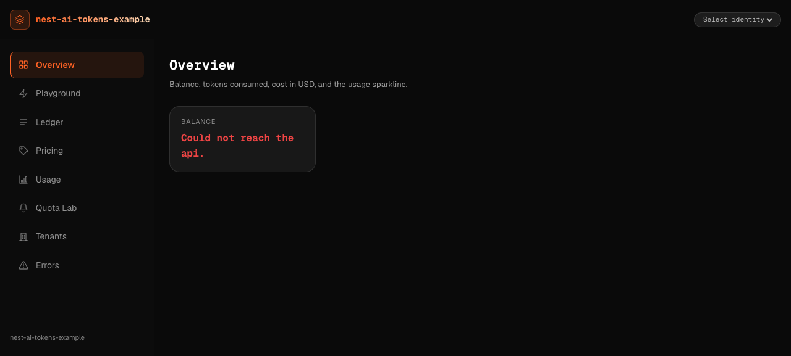

<p align="center">
  
</p>

<h1 align="center">nest-ai-tokens-example</h1>

<p align="center">
  <strong>Reference application for <a href="https://github.com/bymaxone/nest-ai-tokens"><code>@bymax-one/nest-ai-tokens</code></a></strong><br />
  <sub>NestJS 11 · Next.js 16 · React 19 · Postgres 17 · Prisma 7 · Metering · Effective-dated pricing · Wallets · Budgets · Multi-tenant</sub>
</p>

<p align="center">
  <a href="https://github.com/bymaxone/nest-ai-tokens-example/actions/workflows/ci.yml"></a>
  
  
  <a href="https://github.com/bymaxone/nest-ai-tokens-example/blob/main/LICENSE"></a>
  <a href="https://www.typescriptlang.org/"></a>
  <a href="https://nodejs.org/"></a>
  <a href="https://nestjs.com/"></a>
  <a href="https://nextjs.org/"></a>
  <a href="https://react.dev/"></a>
  <a href="https://www.postgresql.org/"></a>
</p>

<p align="center">
  <a href="https://github.com/bymaxone/nest-ai-tokens">📦 Library</a> ·
  <a href="#-quick-start">🚀 Quick Start</a> ·
  <a href="#-whats-inside">✅ Features</a> ·
  <a href="#-scenario-walkthrough">🎬 Scenarios</a> ·
  <a href="#-try-it-with-curl">🧑‍💻 curl</a> ·
  <a href="docs/TECHNICAL_SPECIFICATION.md">📖 Docs</a>
</p>

---

## ✨ Overview

`@bymax-one/nest-ai-tokens` is the **what**; this repository is the **how**. It is a runnable,
production-shaped demo that exercises the library's public surface across a NestJS API and a
Next.js dashboard, against a **deterministic mock AI provider**. No AI vendor SDK is installed and
no API key exists anywhere in the repository. It is three things at once:

- **A runnable demo.** `pnpm infra:up` + `pnpm dev` brings up Postgres 17 and a NestJS service
  wired to the library, plus an eight-page dashboard that fires every capability on demand: a
  metered translate call appearing as a ledger row, a wallet draining into the canonical 402, a
  price update closing its window without rewriting history, and a tenant switch isolating every
  read.
- **A knowledge base.** Every public export of the installed library is either imported by real
  code or explicitly justified in the
  [Feature Coverage Matrix](docs/TECHNICAL_SPECIFICATION.md#7--feature-coverage-matrix), and CI
  enforces that contract with an export audit (`pnpm audit:exports`) whose failure mode is itself
  covered by tests.
- **A copy-paste reference.** `apps/api/src/ai/ai-tokens.config.ts` (module options + store
  binding + scope resolver), the metered-call helper (`hold -> provider -> capture/release`), the
  usage presets, and the typed web client on the `./shared` subpath are written to be lifted
  directly into a real service.

It is a sibling of [`nest-auth-example`](https://github.com/bymaxone/nest-auth-example),
[`nest-logger-example`](https://github.com/bymaxone/nest-logger-example), and
[`nest-cache-example`](https://github.com/bymaxone/nest-cache-example), and follows the same
blueprint, voice, and quality bar: **100% test coverage** on both apps, English-only, and
Conventional Commits.



---

## 🚀 Quick start

> The library is **pre-publish**: it is consumed via a local `file:` link
> (`apps/api/package.json` -> `"@bymax-one/nest-ai-tokens": "file:../../../nest-ai-tokens"`).
> Clone and build that sibling checkout first; nothing else resolves the dependency.

```bash
# 1. The library (sibling checkout, built once)
git clone https://github.com/bymaxone/nest-ai-tokens.git
cd nest-ai-tokens && pnpm install && pnpm build && cd ..

# 2. This example
git clone https://github.com/bymaxone/nest-ai-tokens-example.git
cd nest-ai-tokens-example
pnpm install                              # resolves the file: library link
cp .env.example .env                      # local-only defaults, no secrets
pnpm infra:up                             # Postgres 17 via docker compose (healthcheck-gated)
pnpm --filter api run prisma:migrate:dev  # create the reference schema
pnpm --filter api run prisma:seed         # deterministic demo data (idempotent)
pnpm dev                                  # api -> http://localhost:3001 · web -> http://localhost:3000
```

| Surface                | URL                                   |
| ---------------------- | ------------------------------------- |
| Dashboard (`apps/web`) | <http://localhost:3000>               |
| API hello              | <http://localhost:3001>               |
| API health + wiring    | <http://localhost:3001/health/wiring> |
| Error catalog          | <http://localhost:3001/errors-demo>   |

In CI the org-shared setup action clones and builds the library beside the workspace, so the
`file:` dependency resolves identically. `node scripts/probe-subpaths.mjs` proves the published
subpaths resolve through the package's real `exports` map under Node ESM on every pull request.

---

## 🔥 What's inside

Eight dashboard pages, each mapping to a library capability through the documented REST surface:

| Page           | Library capability demonstrated                                                                                                 |
| -------------- | ------------------------------------------------------------------------------------------------------------------------------- |
| **Overview**   | `WalletService.getBalance`, `LedgerService.sumCost`, `UsageReportService` sparkline                                             |
| **Playground** | Metered inference: five command cards + embeddings via `MeteringService` (`record` and `hold/capture/release`), failure markers |
| **Ledger**     | `LedgerService.query` filters (`UsageStatus`, `AiOperation`), row inspector, refund (`MeteringService.reverse`), top-up         |
| **Pricing**    | `PricingService.resolveRate` catalog, per-model effective-dated history, `upsertPrice` window close                             |
| **Usage**      | `UsageReportService.summarize`: by period (granularity switch), by feature, by model, top consumers, system costs               |
| **Quota Lab**  | Estimator variants: declarative `@RequireBudget` static hold and a programmatic model-based hold; drain and top-up shortcuts    |
| **Tenants**    | `scopeResolver` tenancy: identity switcher, per-tenant balance and ledger isolation                                             |
| **Errors**     | The full 26-code catalog (15 library + 11 host codes) triggered on demand, canonical envelope rendered verbatim                 |

The API surface behind those pages is 35 routes across `workspace`, `ledger`, `pricing`, `usage`,
`quota`, `system-jobs`, `errors-demo`, and `health`; an e2e route inventory diffs the documented
list against the live router in both directions, so the docs cannot drift from the code.

---

## 🎬 Scenario walkthrough

The eight scenarios of
[spec §13](docs/TECHNICAL_SPECIFICATION.md#13--demonstration-scenarios), all walkable in the
browser and all asserted end to end:

1. **Meter a command end to end.** Run Translate in the Playground: the response, the token
   split, the USD cost breakdown, and the new ledger row appear together; the Overview balance
   drops.
2. **Batch embeddings, one transaction.** Embed five texts in batch mode; the Ledger shows ONE
   transaction whose `tags` carry `batch-size:5` (the immutable ledger stores tags, not free-form
   metadata).
3. **Buy a token pack.** The top-up action posts a `purchase` credit; the balance rises; the
   ledger stays append-only (earlier debits remain untouched).
4. **Change a price without rewriting history.** Update `mock-chat-pro` on the Pricing page; the
   history timeline shows the closed window plus its successor, and the backdated-cost helper
   (`POST /errors-demo/helpers/backdated-cost`) still prices past dates on the old window.
5. **Hit the quota wall.** Drain the balance in the Quota Lab until the hold is rejected with the
   canonical `402` `AI_TOKENS_INSUFFICIENT_CREDITS` envelope; top up; retry succeeds.
6. **Tenant isolation.** Switch identity in the header; the Ledger, Usage, and balance all
   change; an e2e proves tenant A queries never return tenant B rows.
7. **System costs stay off user bills.** Run the reindex job; user reports exclude it; the Usage
   system-costs panel groups it under its `systemCostCategory`.
8. **Every error, on demand.** The Errors page fires each triggerable catalog code and renders
   the normalized envelope, HTTP status, and details payload.

---

## 🧑‍💻 Try it with curl

The demo identity travels in plain headers (see the
[disclaimer](#-demo-identity-simulation-only) below). With the stack running:

```bash
# 1. A metered translate call (debits ada's wallet, writes one ledger row)
curl -s -X POST http://localhost:3001/workspace/translate \
  -H 'content-type: application/json' -H 'x-demo-user: ada' \
  -d '{"text":"Hello world","targetLanguages":["pt","es"]}'

# 2. The ledger row it wrote (newest rows, ada's scope only)
curl -s 'http://localhost:3001/ledger/transactions?limit=5' -H 'x-demo-user: ada'

# 3. The combined wallet + budget verdict
curl -s http://localhost:3001/quota/status -H 'x-demo-user: ada'

# 4. Drain to the wall: repeat until the canonical 402 envelope appears
curl -s -X POST http://localhost:3001/quota/lab/constant \
  -H 'content-type: application/json' -H 'x-demo-user: ada' -d '{}'
# -> { "error": { "code": "AI_TOKENS_INSUFFICIENT_CREDITS", ... } } once the balance runs out

# 5. Top up 10 USD and retry
curl -s -X POST http://localhost:3001/ledger/credits \
  -H 'content-type: application/json' -H 'x-demo-user: ada' \
  -d '{"amountNanoUsd":"10000000000","type":"purchase"}'

# 6. Close a price window (admin identity) and read the history
curl -s -X PUT http://localhost:3001/pricing/mock-chat-pro \
  -H 'content-type: application/json' -H 'x-demo-user: root' \
  -d '{"provider":"mock","operation":"chat","inputNanoUsdPerMillion":"700000000","outputNanoUsdPerMillion":"2800000000","reasoningNanoUsdPerMillion":"2800000000"}'
curl -s 'http://localhost:3001/pricing/mock-chat-pro/history?provider=mock' -H 'x-demo-user: ada'

# 7. Raise any catalog error on demand
curl -s -X POST http://localhost:3001/errors-demo/provider.rate_limited -H 'x-demo-user: ada'
```

All money is **BigInt nano-USD** end to end; the wire carries decimal strings and the dashboard
formats them with the library's own `formatNanoUsd`. No float ever touches a cost.

---

## 🧪 Tests and gates

| Gate                                     | What it proves                                                                                                             |
| ---------------------------------------- | -------------------------------------------------------------------------------------------------------------------------- |
| `pnpm --filter api run test:cov`         | 424 unit tests, 100% statements/branches/functions/lines                                                                   |
| `pnpm --filter api run test:e2e`         | 198 e2e tests over Testcontainers Postgres: every route, error code, guard path, and module boot variant                   |
| `pnpm --filter web run test:cov`         | 305 tests, 100% on `lib/**` and every component state and interaction                                                      |
| `pnpm --filter web run test:integration` | The dashboard shell against mocked wire responses                                                                          |
| `pnpm audit:exports`                     | Every real library export is imported by the apps or ⛔-justified in spec §7 (the audit's own failure mode is unit-tested) |
| `node scripts/probe-subpaths.mjs`        | The package `exports` map resolves under Node ESM                                                                          |

The e2e route inventory (`apps/api/test/e2e/inventory.e2e-spec.ts`) asserts the documented route
list equals the live Express registration, and that all 26 error codes keep a named proof in the
e2e sources. Suites run sequentially with bounded workers; the e2e tier provisions its own
Postgres via Testcontainers on random ports (the compose Postgres is only for `pnpm dev`).

---

## 🧭 Demo identity (simulation only)

The API resolves its caller from two plain request headers: `x-demo-user` (one of `ada`, `grace`,
`linus`, `root`) and an optional `x-tenant-id` override. **This is a simulation, not
authentication**: headers are not a trust boundary and nothing is verified. It exists so the
dashboard can switch identities without dragging an auth stack into a ledger example. A real
service must materialize `req.user` from verified credentials, exactly what
[`nest-auth-example`](https://github.com/bymaxone/nest-auth-example) demonstrates with
`@bymax-one/nest-auth`; that verified identity is what the library's `scopeResolver` should read.
Unknown demo users receive a 401 listing the valid ids.

---

## 🧱 Honest boundaries

What this example deliberately does **not** do, and where the escape hatch is:

- **No real AI provider.** Inference is a deterministic mock (`apps/api/src/ai/mock-ai.provider.ts`)
  that doubles as SDK-adapter documentation; failures are injected with `@@fail:*@@` markers.
  `openai` is not installed, proving the library's optional-peer claim.
- **No billing or payments.** Wallet credits are demo endpoints; a real service wires its payment
  provider to `WalletService.grant`.
- **No streaming.** The library's `StreamUsageCollector` is exercised in the error catalog, but
  the workspace endpoints are request/response by design.
- **No authentication.** See the demo-identity disclaimer above.
- **Pre-publish link mode.** The `file:` dependency and the sibling-build requirement disappear
  when the library ships to npm (the dependency becomes a registry range).

---

## 🏗️ Architecture

```
apps/web (Next.js 16, port 3000)
  └─ typed api client  ── imports ONLY @bymax-one/nest-ai-tokens/shared (CI-enforced)
       │  x-demo-user / x-tenant-id headers · cross-origin fetch (CSP connect-src)
       ▼
apps/api (NestJS 11, port 3001)  ── CORS allow-list from WEB_ORIGIN (default :3000)
  ├─ identity middleware (demo users)          ── simulation, not auth
  ├─ workspace / quota  ── MockAiProvider + MeteringService (hold -> capture/release, record)
  ├─ ledger / usage     ── LedgerService · WalletService · UsageReportService
  ├─ pricing            ── PricingService (effective-dated windows, boot seed)
  ├─ errors-demo        ── 26-code catalog, on-demand triggers
  └─ BymaxAiTokensModule.forRootAsync
       └─ store: PrismaAiTokensStore (@bymax-one/nest-ai-tokens/prisma)
            ▼
      Postgres 17 (Prisma 7, BigInt nano-USD money, reference schema)
```

---

## 📖 Documentation

- [`docs/TECHNICAL_SPECIFICATION.md`](docs/TECHNICAL_SPECIFICATION.md): the technical blueprint,
  including the audited [Feature Coverage Matrix](docs/TECHNICAL_SPECIFICATION.md#7--feature-coverage-matrix).
- [`docs/DEVELOPMENT_PLAN.md`](docs/DEVELOPMENT_PLAN.md): the phased execution plan and progress
  dashboard.
- [`docs/tasks/README.md`](docs/tasks/README.md): the per-phase task breakdown, including the
  Reconciliation notes that map the drafted design onto the shipped library surface.
- [`CHANGELOG.md`](CHANGELOG.md): Keep a Changelog format.

## 🤝 Contributing

The project follows a documented phase plan; start at
[`docs/DEVELOPMENT_PLAN.md`](docs/DEVELOPMENT_PLAN.md). Conventional Commits are enforced by
husky + commitlint; every change lands with tests holding both apps at 100% coverage.

## 📄 License

[MIT](LICENSE)
